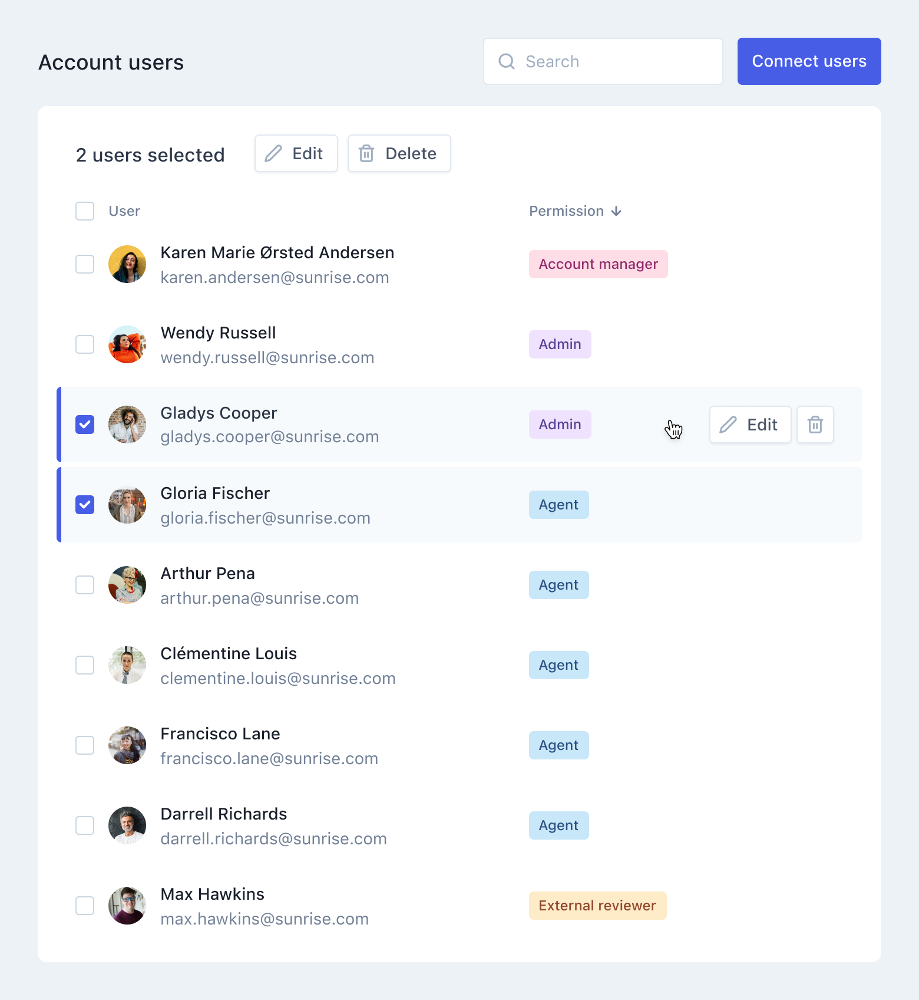

# klaus-app: Frontend Engineer Test Task 

A test task for [Klaus](https://www.klausapp.com) frontend engineering position.
Built the following small part of the users list using provided static data (JSON file of users).



Reference design is hosted in [Figma](https://www.figma.com/) (account is needed for Inspect mode):
https://www.figma.com/file/OXpV1JmHeq9AMZqSWpC3tL/FE-Test-Task?node-id=1%3A528

Static JSON list of fake users is in this repository ([`users.json`](users.json)).


## Task

* Implement the given UI on a level of detail you deem necessary. Feel free to pick your own UI framework and libraries.


## Execution

* Users list is searchable by users' name. It enables to check all the users at once or check a user one by one. It also enables to delete users one by one or more than one at a time. All the buttons have interactive design. List is sortable by user role.


## Technologies used

- Vue
- Tailwind
- Yarn


## Project setup
```
yarn install
```

### Compiles and hot-reloads for development
```
yarn serve
```

### Compiles and minifies for production
```
yarn build
```

### Lints and fixes files
```
yarn lint
```

### Customize configuration
See [Configuration Reference](https://cli.vuejs.org/config/).
